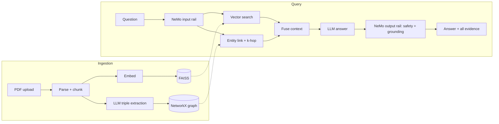

# Hybrid RAG: FAISS + Knowledge Graph

Ask questions about your PDFs and see **exactly how each answer was built**. Every PDF is indexed twice, once as
vectors (FAISS) and once as a knowledge graph (NetworkX). Both are searched for every question, fused into one
prompt, and the answer is checked by guardrails, scored by DeepEval and traced in LangSmith.

| Concern | Tool |
|---|---|
| Vector index | FAISS (exact cosine search) + sentence-transformers |
| Knowledge graph | NetworkX, triples extracted by the LLM |
| LLM | OpenAI (default) or Anthropic Claude, switched with `LLM_PROVIDER` |
| Guardrails | NVIDIA NeMo Guardrails (input and output rails) |
| Evaluation | DeepEval (your configured LLM as judge) |
| Backend / Frontend | FastAPI / Streamlit |
| Tracing and maintenance | LangSmith |

## Quick start (Python 3.11+)

```bash
scripts/setup.sh                 # creates .venv, installs everything, creates .env   (Windows: scripts\setup.bat)
# edit .env and set OPENAI_API_KEY=sk-...   (or LLM_PROVIDER=anthropic + ANTHROPIC_API_KEY)

make api                         # terminal 1  ->  http://localhost:8000/docs
make ui                          # terminal 2  ->  http://localhost:8501
```

No `make`? Use `scripts/run_api.sh` and `scripts/run_ui.sh` (`.bat` versions on Windows), or activate the venv
and run `python -m backend.app` and `streamlit run frontend/app.py`.

Then: **Documents** tab, upload a PDF, wait for both pipelines; **Ask** tab, ask a question.

Good to know before the first run:
- You need an API key with credits for your provider. A ChatGPT subscription does not include API access; create a key at platform.openai.com.
- Do not put a comment after an empty value in `.env` (for example `LLM_MODEL=   # note`). It would be read as the value. Put comments on their own line.
- `sentence-transformers` installs PyTorch, which is large. On a machine without a GPU run `TORCH_CPU=1 scripts/setup.sh` to get the small CPU build.
- The embedding model (about 90 MB) downloads from Hugging Face the first time you ingest or ask.
- Scanned PDFs have no text layer; run OCR first (for example `ocrmypdf`). The upload will tell you so.

## How it works



**Design decisions worth knowing**
- **Shared chunk ids.** Each graph fact remembers the chunk it came from, so a graph fact can always be traced to real text. Facts whose source chunk vector search missed are pulled in as extra evidence; chunks that both retrievers agree on get a score boost.
- **Entity linking, not string luck.** Questions are mapped to graph nodes by exact name, partial name, and embedding similarity, then expanded `KG_HOPS` hops.
- **Guardrails wrap the pipeline.** NeMo runs as a gate (`check_async`) before retrieval and after generation. The output rail includes a grounding check against the exact evidence the model saw. If the rails themselves crash, the request is blocked (`GUARDRAILS_FAIL_OPEN=false`).
- **Graceful degradation.** If graph extraction fails, the document is still searchable by vector. Blocked or empty-context requests never reach the generator.
- **Long work is a job.** Ingestion and evaluation return a `job_id` immediately; the UI polls it.
- **Evaluation is linked to tracing.** Each DeepEval score is attached to the LangSmith run that produced the answer.

## Using the app

- **Ask:** choose hybrid, vector-only or graph-only retrieval to compare them. You see the answer with citations, the FAISS passages with scores, the linked entities, retrieved facts and a graph drawing, the guardrail results, timings, the exact prompt context, models used and the LangSmith run id.
- **Documents:** upload, watch progress, delete. Re-uploading the same PDF replaces it.
- **Evaluation:** type questions (with optional expected answers) or generate them from your documents, pick metrics, run, browse and download reports (also saved in `data/eval/`).

Metrics: `faithfulness`, `answer_relevancy`, `contextual_relevancy`, plus `contextual_precision` and `contextual_recall`
(these two need an expected answer).

## Configuration

Everything is in `.env` (documented line by line in `.env.example`). The ones you are most likely to touch:

| Variable | Default | Purpose |
|---|---|---|
| `LLM_PROVIDER` | `openai` | `openai` or `anthropic` |
| `OPENAI_API_KEY` / `ANTHROPIC_API_KEY` | (empty) | Key for the chosen provider. Needed for graph extraction, answers, guardrails and evaluation |
| `OPENAI_BASE_URL` | (empty) | Optional: Azure, a proxy or another OpenAI-compatible gateway |
| `LLM_MODEL`, `JUDGE_MODEL` | empty = `gpt-4o` (`claude-sonnet-5` on Anthropic) | Answer and judge models. Any model your key can access |
| `EXTRACTION_MODEL`, `GUARDRAIL_MODEL` | empty = `gpt-4o-mini` (`claude-haiku-4-5-20251001` on Anthropic) | Cheaper models for the many small calls |
| `KG_EXTRACTION_ENABLED` | `true` | `false` = vector-only ingestion with no LLM calls |
| `KG_EXTRACTION_CONCURRENCY` | `4` | Lower it if you hit rate limits |
| `VECTOR_TOP_K`, `KG_HOPS`, `KG_MAX_TRIPLES` | `5`, `1`, `15` | Retrieval breadth (also adjustable per question in the UI) |
| `GUARDRAILS_ENABLED` | `true` | Turn NeMo rails off to isolate a problem |
| `LANGSMITH_TRACING` + `LANGSMITH_API_KEY` | off | Enable tracing |
| `CHUNK_SIZE` / `CHUNK_OVERLAP` | `900` / `150` | Characters. Changing them requires re-ingesting |

Changing `EMBEDDING_MODEL` makes the stored vectors incomparable: the API detects this and asks you to delete
`data/indexes/` and re-ingest.

## API

Interactive docs at `http://localhost:8000/docs`. All routes are under `/api/v1`.

| Method and path | Purpose |
|---|---|
| `GET /health`, `GET /stats` | Liveness; index sizes and active configuration |
| `POST /documents` (multipart `file`) | Start ingestion, returns `job_id` (202) |
| `GET /documents`, `DELETE /documents/{doc_id}` | List / remove a document from both indexes |
| `GET /jobs/{job_id}` | Job status, progress and result |
| `POST /query` | Answer a question; returns the answer plus every intermediate artefact |
| `POST /evaluate`, `GET /jobs/{job_id}` | Start a DeepEval run |
| `POST /evaluate/generate` | Generate test questions from your documents |
| `GET /evaluate/metrics`, `/evaluate/reports`, `/evaluate/reports/{name}` | Metrics and saved reports |

## Project layout

```
backend/app/
  core/         settings, logging, LLM wrapper, LangSmith helpers, errors
  domain/       Pydantic models shared by every layer
  ingestion/    PDF loading (PyMuPDF) and chunking
  vector/       embeddings + persistent FAISS store
  graph/        triple extraction, NetworkX store, entity linker, graph retriever
  retrieval/    hybrid retriever (parallel) and context fusion
  generation/   prompts and answer generation
  guardrails/   NeMo engine + config/ (config.yml, Colang flows, prompts, custom action)
  evaluation/   LLM judge adapter for DeepEval, metrics, runner, question generator
  services/     ingestion, RAG, jobs, registry, dependency container
  api/          FastAPI routes and error mapping
frontend/       Streamlit app, API client, components
tests/          77 tests: unit, API end-to-end, real NeMo and DeepEval runs, Streamlit AppTest
data/           uploads, indexes (FAISS + GraphML), evaluation reports (git-ignored)
```

## Testing

```bash
make test        # or: .venv/bin/python -m pytest -q
make lint
```

The suite needs no API key and no model download: it uses a deterministic fake embedder and fake LLMs, but runs the
real FAISS, NetworkX, PyMuPDF, NeMo Guardrails config, DeepEval metrics, FastAPI app and Streamlit UI.

## Troubleshooting

| Symptom | Fix |
|---|---|
| "OPENAI_API_KEY is not set" (or ANTHROPIC_API_KEY) | Put the key in `.env` and **restart the API** (settings load at start-up) |
| 404 / "model not found" / no access to model | Set `LLM_MODEL`, `EXTRACTION_MODEL`, `GUARDRAIL_MODEL`, `JUDGE_MODEL` to models your key can use |
| Every question is blocked, "guardrails-unavailable" | The rail LLM call failed (invalid key, no credits, network, rate limit); the message shows the reason. Check the API log; `GUARDRAILS_ENABLED=false` isolates it |
| Graph is empty after ingest | Extraction failed for the chunks (see the warning in the Documents tab and the API log). Vector search still works |
| 429 / rate limits during ingest | Lower `KG_EXTRACTION_CONCURRENCY` |
| "Backend offline" in the UI | Start the API; check `BACKEND_URL` in `.env` |
| Port already in use | Change `API_PORT` (and `BACKEND_URL`), or `UI_PORT=8600 scripts/run_ui.sh` |
| Vector index was built with a different embedding model | Delete `data/indexes/` and re-ingest |

## Production notes

- FAISS uses exact search (`IndexFlatIP`), ideal up to a few hundred thousand chunks. For more, switch to an HNSW or IVF index in `vector/faiss_store.py`.
- Indexes live on local disk and ingestion is serialised in one process. To scale out, move the stores behind a database or vector service and run ingestion in a worker queue.
- Job state is in memory and is lost on restart; finished indexes and reports are on disk.
- There is no authentication. Put the API behind a gateway before exposing it.
